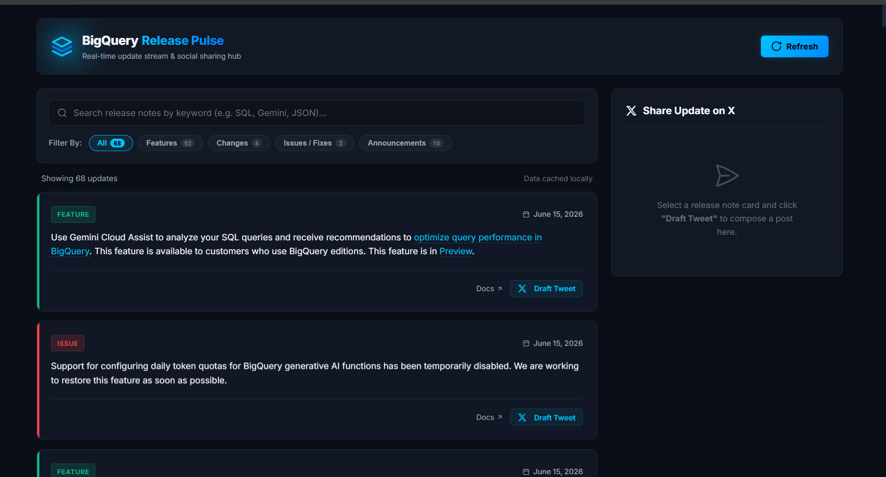

# BigQuery Release Notes Dashboard

A Flask-based web application that fetches and displays the latest Google BigQuery release notes from the official RSS feed.

## Live Demo
🚀 [Open Live Application](https://bigquery-release-notes-dashboard.onrender.com)

## Source Code
📂 [View GitHub Repository](https://github.com/Sai-Likitha-Madisetty/bigquery-release-notes-dashboard)

## Application Preview


## Features

* Fetches BigQuery release notes from the official Google Cloud RSS feed
* Displays the latest updates in a clean and user-friendly interface
* Refresh button with loading indicator
* View release note details instantly
* Generate tweet-ready content from selected updates
* Built with Python Flask, HTML, CSS, and JavaScript

## Tech Stack

* Python
* Flask
* HTML
* CSS
* JavaScript
* RSS/XML Feed Processing

## Data Source

Google Cloud BigQuery Release Notes RSS Feed:

https://docs.cloud.google.com/feeds/bigquery-release-notes.xml

## Installation

1. Clone the repository

```bash
git clone https://github.com/Sai-Likitha-Madisetty/bigquery-release-notes-dashboard.git
```

2. Navigate to the project directory

```bash
cd bigquery-release-notes-dashboard
```

3. Install dependencies

```bash
pip install -r requirements.txt
```

4. Run the application

```bash
python app.py
```

## Learning Outcomes

* RSS/XML feed ingestion and processing
* Flask web application development
* Frontend integration using HTML, CSS, and JavaScript
* Building and testing AI-generated applications
* Understanding AI-assisted software development workflows

## Acknowledgement

This project was created during Google's **5-Day AI Agents: Intensive Vibe Coding Course**.

The application was generated using **Google Antigravity** based on natural-language prompts. The repository owner configured the development environment, reviewed the generated code, tested the application, managed version control with Git/GitHub, and maintained the project.

This repository is intended as a demonstration of modern AI-assisted software development and agentic engineering workflows.

## Author

**Sai Likitha Madisetty**
B.Tech in Artificial Intelligence & Data Science
